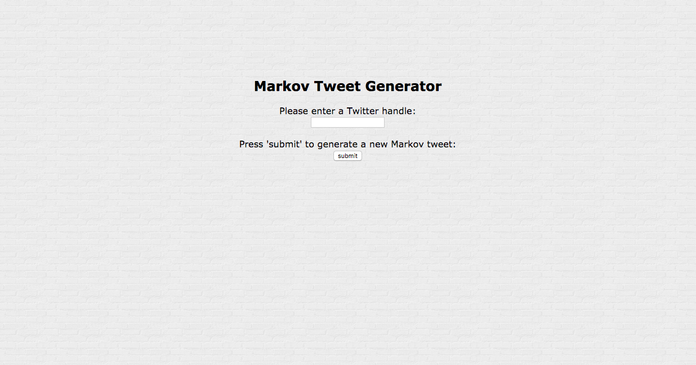
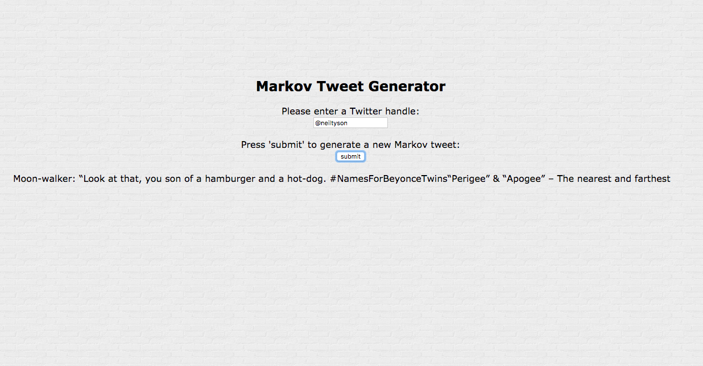
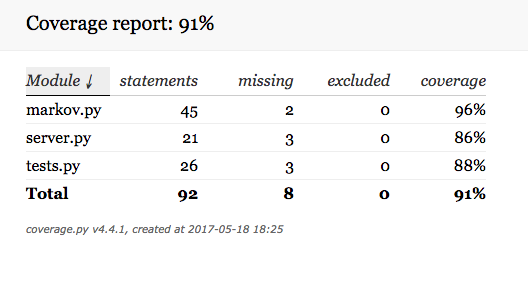

# markov_tweet_generator

Markov Tweet Generator is a web app that turns tweets into Markov chains and generates a new tweet from these chains.
 
---
 
## Features and Coverage
 
1) input any publicly available Twitter handle
2) generate and display new Markov tweets based on tweets from any single Twitter feed 
3) cache Markov chains
4) 91% test coverage
---
 
## Web App Screen Shots
 

### Homepage

 

### Display New Markov Tweet
 

 

### Test Coverage
 

 

### Languages
Python, JavaScript, HTML, CSS
 
### APIs
Twitter API

### Technologies
Flask, PostgreSQL,
JQuery, AJAX
pickle, tweepy, virtualenv
 

---
